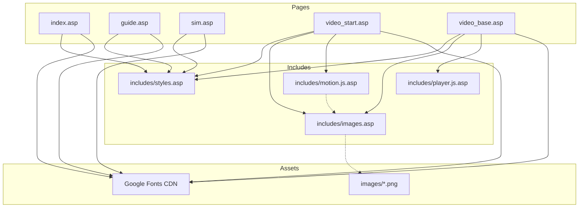

# ALTWELL SMART GUIDE ? Architecture Report

> **Project:** `mobile_2017/guide_page`  
> **Stack:** Classic ASP (SSI) + Vanilla HTML/CSS/JS  
> **Generated:** 2026-07-13  
> **Status:** Refactored from monolithic SPA (`index.asp.bak`) into multi-page ASP app

---

## Executive Summary

This project is **not a React application**. It is a server-rendered, multi-page web experience built with Classic ASP Server-Side Includes (SSI), inline CSS, and vanilla JavaScript. The codebase implements an interactive business-guide platform with two parallel animation architectures:

1. **Legacy Player Engine** ? timeline-driven scene playback (`player.js.asp` + `video_base.asp`)
2. **Object & Motion Library** ? Design Bible component system (`motion.js.asp` + `video_start.asp`)

There is no bundler, no npm, no TypeScript, and no component framework.

---

## 1. Folder Structure

```
guide_page/
├── index.asp                 # Entry point ? home landing page
├── guide.asp                 # Guide video list (4 steps)
├── sim.asp                   # Simulator list
├── video_start.asp           # STEP 1 video ? layout/motion canvas (static)
├── video_base.asp            # STEP 2 video ? interactive 3-min player
├── index.asp.bak             # Legacy monolithic SPA backup (2,546 lines, inactive)
├── ARCHITECTURE.md           # This document
│
├── images/                   # Static image assets (14 PNG files)
│   ├── member.png
│   ├── people.png
│   ├── basebusiness_icon.png
│   ├── autoship_icon.png
│   ├── referral_bonus_icon.png
│   ├── altpack_icon.png
│   ├── lev01_d.png           # Rank D
│   ├── lev02_p.png           # Rank P
│   ├── lev03_jp.png          # Rank JP
│   ├── lev04_sp.png          # Rank SP
│   ├── lev05_fc.png          # Rank FC
│   ├── lev06_gc.png          # Rank GC (defined, unused)
│   ├── lev07_dc.png          # Rank DC (defined, unused)
│   └── lev08_rf.png          # Rank RF (defined, unused)
│
└── includes/                 # Shared modules (SSI includes)
    ├── images.asp            # VBScript image path constants
    ├── styles.asp            # Global CSS (~1,089 lines)
    ├── motion.js.asp         # Object & Motion Library JS API
    └── player.js.asp         # Legacy player timeline engine
```

### File Count Summary

| Category | Count | Notes |
|----------|------:|-------|
| Active ASP pages | 5 | `index`, `guide`, `sim`, `video_start`, `video_base` |
| Include modules | 4 | `images`, `styles`, `motion.js`, `player.js` |
| Image assets | 14 | All under `images/` |
| Separate `.css` files | 0 | All CSS in `styles.asp` |
| Separate `.js` files | 0 | All JS in `.asp` includes or inline |
| React components | 0 | N/A |

---

## 2. Every React Component

**None.**

This project does not use React, JSX, TSX, Vue, Angular, or any UI framework. UI is composed of:

- Plain HTML elements in `.asp` page files
- CSS class-based "components" (Object Library pattern)
- DOM manipulation via vanilla JavaScript

### HTML "View" Pages (functional equivalents to pages/routes)

| File | Role | Key DOM Root |
|------|------|--------------|
| `index.asp` | Home / landing | `#home-page`, `#hero` |
| `guide.asp` | Guide video catalog | `#guide-page`, `#vcards` |
| `sim.asp` | Simulator catalog | `#sim-page`, `.sim-grid` |
| `video_start.asp` | STEP 1 layout preview | `#layout-ov`, `#lo-canvas` |
| `video_base.asp` | STEP 2 interactive player | `#overlay`, `#stage`, `#si` |

### Legacy Dev UI (only in `index.asp.bak`)

| Panel | ID | Purpose |
|-------|-----|---------|
| Object Library Preview | `#lib-preview` | Dev component tester |
| Library Launcher | `#lib-launcher` | Floating "LIB" button |
| SPA Page System | `.page` | `goto()` routing between views |

---

## 3. Every CSS File

**No standalone `.css` files exist.** All styles live in a single include:

### `includes/styles.asp` (~1,089 lines)

Included by every page via SSI:

```html
<style>
<!--#include file="includes/styles.asp"-->
</style>
```

### CSS Section Map

| Section | Lines (approx) | Selectors / Scope |
|---------|----------------|-------------------|
| CSS Variables | 2?20 | `:root` ? colors, motion tokens, glow tokens |
| Base Reset | 1, 28?30 | `*`, `html`, `body`, `button`, `img` |
| Navigation | 25?75 | `#nav`, `.nav-back`, `.nav-logo`, `body.d1/d2` |
| Page System | 70?85 | `.page`, `.page.on` |
| Home (Depth-1) | 80?160 | `#hero`, `.hero-badge`, `.hcta` |
| List Pages (Depth-2) | 155?266 | `.list-wrap`, `.vcard`, `.sc-card` |
| Player Overlay (Depth-3) | 261?465 | `#overlay`, `#stage`, `.mn`, `.gl`, `#icard` |
| Layout Preview | 467?723 | `#layout-ov`, `#lo-canvas`, `#lo-panel` |
| Object Library §3 | 725?855 | `.member-unit`, `.rank-medal`, `.bonus-plate` |
| Motion Library §5 | 862?947 | `@keyframes`, `.motion-*`, `.is-*` |
| Component Preview §9 | 949?1079 | `#lib-preview`, `.lib-tab` (Dev UI) |
| Standalone Overrides | 1080?1088 | `body.page-home/list/video/layout` |
| Portrait Media Query | 1068?1079 | `#layout-ov` 90° rotation |

### CSS Design Tokens (`:root`)

```css
--red: #EE3338
--motion-fast: 300ms
--motion-normal: 600ms
--motion-slow: 900ms
--ease-standard: ease-out
--ease-emphasis: cubic-bezier(0.22, 1, 0.36, 1)
--glow-red / --glow-green / --glow-blue / --glow-gold
```

---

## 4. Every JS/TS Utility

**No TypeScript.** All JavaScript is vanilla ES5-style in `.asp` files.

### `includes/player.js.asp` ? Player Engine Utilities

| Symbol | Type | Description |
|--------|------|-------------|
| `TOTAL` | `const` | Total duration: 180 seconds (3 min) |
| `T` | `var` | Current playback time (seconds) |
| `playing` | `var` | Play/pause state |
| `rafId` | `var` | `requestAnimationFrame` handle |
| `lastTS` | `var` | Last RAF timestamp |
| `fired` | `Set` | Executed EVS event indices |
| `FF` | `var` | Fast-forward mode (seek) |
| `E(id)` | function | `document.getElementById` shorthand |
| `add(id, c)` | function | Add CSS class |
| `rem(id, c)` | function | Remove CSS class |
| `txt(id, v)` | function | Set `textContent` |
| `show(id)` | function | Reveal element (`.show` class, rAF) |
| `hide(id)` | function | Hide element (remove `.show`) |
| `drawLine(id)` | function | Animate SVG connector (`.gl.on`) |
| `setInfo(label, lines)` | function | Render info panel `#icard` |
| `bonusAnim(fromId)` | function | Coin fly animation between nodes |
| `countUp(id, to, dur)` | function | Animated number counter (?) |
| `sceneLabel(t)` | function | Resolve scene label from `SCENES` |
| `fmt(s)` | function | Format seconds → `m:ss` |
| `updateUI(t)` | function | Update timeline bar, time, scene label |
| `process(t)` | function | Dispatch EVS events at time `t` |
| `rafTick(ts)` | function | Main animation loop |
| `togglePlay()` | function | Play/pause toggle |
| `resetDOM()` | function | Reset all player DOM state |
| `doRestart()` | function | Full player restart |
| `onSeek(ev)` | function | Timeline scrub/seek handler |
| `TRANS_SEL` | `const` | CSS selector for transition reset |
| `EVS` | `array` | Event timeline (48 events) |
| `SCENES` | `array` | Scene label breakpoints (12 scenes) |

### `includes/motion.js.asp` ? Motion API Utilities

| Symbol | Type | Description |
|--------|------|-------------|
| `RANK_IMGS` | `object` | Rank → image path map (D/P/JP/SP/FC) |
| `wait(ms)` | function | `Promise`-based delay |
| `_el(target)` | function | Resolve string selector → element |
| `_els(target)` | function | Resolve selector → element array |
| `_clearAnim(el)` | function | Force animation reflow reset |

### Page-Inline Utilities

| File | Function | Description |
|------|----------|-------------|
| `guide.asp` | `setView(mode, btn)` | Toggle grid/list card layout |
| `video_base.asp` | `backUrl` | IIFE ? resolve return URL from `?from=` |
| `video_base.asp` | `breadcrumbMap` | Breadcrumb text map |
| `video_base.asp` | `closePlayer()` | Stop RAF, navigate back |

### Legacy-Only Utilities (`index.asp.bak`)

| Function | Description |
|----------|-------------|
| `setDepth(d)` | Set `body.d1` or `body.d2` |
| `goto(id)` | SPA page routing |
| `goBack()` | Navigate to home |
| `openLayout()` / `closeLayout()` | Toggle `#layout-ov` |
| `openPlayer(from)` / `closePlayer()` | Toggle `#overlay` player |
| `openLibPreview()` / `closeLibPreview()` | Dev library panel |
| `switchLibTab(name, btn)` | Library tab switcher |
| `testMotion(type)` | Motion test runner |
| `resetMotionTest()` | Reset motion test target |
| `testStagger()` / `resetStagger()` | Stagger fade tests |
| `testRankReplace(toRank)` | Rank replace animation test |
| `testComboEnter()` | Async full combo enter sequence |
| `testComboAcquire()` | Async badge acquire sequence |
| `testComboCheck()` | Async SEP condition check |
| `resetCombo()` | Reset combination preview |

---

## 5. Every Animation Function

### A. CSS `@keyframes` (`includes/styles.asp`)

| Keyframe | Duration Token | Purpose |
|----------|----------------|---------|
| `hdot` | 2s infinite | Home hero badge dot pulse |
| `pdot` | 2s infinite | Player header red dot pulse |
| `rpulse` | 2s infinite | Member ring glow pulse |
| `bglow` | 1.8s infinite | Autoship/SEP element glow |
| `kf-enter` | `--motion-normal` | Fade + scale entrance |
| `kf-acquire` | 800ms | Glow + bounce acquisition |
| `kf-glow-once` | 700ms | One-shot glow flash |
| `kf-rank-out` | 300ms | Rank medal exit |
| `kf-rank-in` | 400ms | Rank medal entrance |
| `kf-slide-up` | 550ms | Text slide up |
| `kf-check-pop` | 600ms | Condition check pop |
| `kf-stagger-item` | 500ms | Staggered item fade |
| `kf-idle-float` | 3s infinite | Idle breathing float |
| `kf-highlight-pulse` | 700ms | Condition highlight ring |

### B. Motion CSS Classes

| Class | Maps To |
|-------|---------|
| `.motion-enter` | `kf-enter` |
| `.motion-acquire` | `kf-acquire` |
| `.motion-slide-up` | `kf-slide-up` |
| `.motion-check` | `kf-check-pop` |
| `.motion-idle-float` | `kf-idle-float` |
| `.is-entering` | `kf-enter` (alias) |

### C. Object State CSS Classes

| Class | Meaning |
|-------|---------|
| `.is-hidden` | `opacity: 0`, no pointer events |
| `.is-inactive` | `opacity: 0.32`, grayscale |
| `.is-active` | Full opacity, no filter |
| `.is-visible` | Status check visible |
| `.show` | Player element visible (transition) |
| `.on` | SVG line drawn / element active |
| `.glow` | Highlight glow state |
| `.blue` | Member image color transition |

### D. JavaScript Animation Functions

#### Motion API (`motion.js.asp`)

| Function | Animation Type | Returns |
|----------|----------------|---------|
| `enterElement()` | Fade + Scale | `Promise` |
| `exitElement()` | Fade Out + scale down | `Promise` |
| `acquireElement()` | Glow + Bounce + optional glow-once | `Promise` |
| `replaceRank()` | Rank out → swap → rank in → glow | `Promise` |
| `completeCondition()` | Highlight pulse + check pop | `Promise` |
| `slideUpElement()` | Slide up (supports stagger) | `Promise.all` |
| `staggerFade()` | Sequential item fade | `Promise.all` |
| `resetMotion()` | Clear all animation state | void |
| `resetScene()` | Reset all Object Library elements | void |

#### Player Engine (`player.js.asp`)

| Function | Animation Type |
|----------|----------------|
| `show()` / `hide()` | CSS transition via `.show` class |
| `drawLine()` | SVG `stroke-dashoffset` via `.gl.on` |
| `bonusAnim()` | DOM coin element with CSS transition fly |
| `countUp()` | RAF number interpolation |
| `rafTick()` | Master timeline loop |
| `onSeek()` | Instant state apply (FF mode) |

---

## 6. Every Object Library Component

Based on **ALTWELL Motion Design Bible §3**. Defined in `styles.asp`, used in `video_start.asp`.

### Member System

| Component | CSS Classes | HTML IDs (video_start.asp) | Attributes |
|-----------|-------------|---------------------------|------------|
| Member Unit (Main) | `.member-unit` | `member-unit-main` | Absolute positioned |
| Member Unit (Child) | `.member-unit.member-child` | `member-unit-left`, `member-unit-right` | ~70% of main size |
| Member Visual | `.member-visual` | `member-visual-main/left/right` | Image + emblem container |
| Member Image | `.member-image` | `member-image-main/left/right` | Circular `object-fit` |
| Emblem Layer | `.member-emblems` | `member-emblems-main/left/right` | `pointer-events: none` |

### Badges & Emblems

| Component | CSS Classes | HTML IDs | Data Attributes |
|-----------|-------------|----------|-----------------|
| Rank Medal | `.rank-medal` | `rank-medal-main` | `data-rank` (D/P/JP/SP/FC) |
| BASE Qualification | `.qualification-badge.base-business` | `base-business-badge-main` | ? |
| Autoship Emblem | `.condition-emblem.autoship-emblem` | `autoship-emblem-main/left/right` | `data-condition` |
| SEP Metric Badge | `.metric-badge.sep-badge` | `sep-badge-left/right` | `data-status`: incomplete/complete/highlighted |
| Status Check | `.status-check` | Dynamically created | Added by `completeCondition()` |

### Income / Bonus

| Component | CSS Classes | HTML IDs | Notes |
|-----------|-------------|----------|-------|
| Bonus Stack | `.member-income.bonus-stack` | `bonus-stack-main` | HTML div, not image |
| Support Bonus Plate | `.bonus-plate.support-bonus` | `support-bonus-main` | Red dot indicator |
| Recommend Bonus Plate | `.bonus-plate.recommend-bonus` | `recommend-bonus-main` | Green dot indicator |

### Scene Text (Layout Panel)

| Component | CSS Classes | HTML IDs |
|-----------|-------------|----------|
| Panel Title | `#panel-fixed-title` | `panel-fixed-title` |
| Scene Title | `.scene-title` | `scene-title-main` |
| Bullet List | `.scene-bullet-list` | `scene-bullets` |
| Bullet Item | `.bullet-item` | `bullet-1`, `bullet-2` |
| Bullet Dot | `.bullet-dot` | ? |
| Bullet Text | `.bullet-text` | ? |

### Layout Canvas Decorations

| Component | ID | Purpose |
|-----------|-----|---------|
| Background Circles | `bg-circle-1/2/3` | Radial gradient decor |
| Dot Pattern | `dot-pattern` | Grid dot overlay |
| SVG Connectors | `lo-connectors`, `connector-left/right` | Relationship lines |

### Legacy Player Components (`video_base.asp`)

Abbreviated DOM model parallel to Object Library:

| Component | CSS Classes | HTML IDs |
|-----------|-------------|----------|
| Member Node | `.mn` | `mm`, `dl-l`, `dl-r`, `ex-m`, `dl-lc`, `dl-rc` |
| Member Body | `.mb.lg/md/sm` | Size variants |
| Member Image | `.mi`, `.mi-wrap` | Gray/blue transition |
| Medal | `.m-medal` | `mm-med` |
| BASE Badge | `.m-biz` | `mm-biz` |
| Autoship | `.m-as` | `mm-as`, `dl-l-as`, `dl-r-as` |
| SEP Label | `.m-sep` | `mm-sep`, `dl-l-sep`, `dl-r-sep` |
| Check Mark | `.m-chk` | `mm-chk`, `dl-l-chk`, `dl-r-chk` |
| Ring | `.m-ring` | `mm-ring` |
| Name Plate | `.m-plate` | `mm-pl` |
| SVG Lines | `.gl` | `gl-l`, `gl-r`, `gl-lc`, `gl-rc` |
| Bonus Widget | `#bpw`, `#bpi` | Bonus plate image overlay |
| Warning | `#warn` | Condition maintenance alert |
| Scene Chips | `.sc` | `sc1`, `sc2`, `sc3` |
| Ending | `#ending`, `#cta-row` | Closing message + CTAs |
| Info Card | `#icard` | Side panel narration |

---

## 7. Every Motion API

Public API surface in `includes/motion.js.asp`.

### Constants

```javascript
var RANK_IMGS = {
  D:  '<%=lev01Img%>',   // images/lev01_d.png
  P:  '<%=lev02Img%>',   // images/lev02_p.png
  JP: '<%=lev03Img%>',   // images/lev03_jp.png
  SP: '<%=lev04Img%>',   // images/lev04_sp.png
  FC: '<%=lev05Img%>'    // images/lev05_fc.png
};
```

### API Reference

#### §8 Object State

| API | Signature | Description |
|-----|-----------|-------------|
| `showElement` | `(target: string\|Element) → void` | Remove `.is-hidden` |
| `hideElement` | `(target: string\|Element) → void` | Add `.is-hidden` |
| `activateElement` | `(target) → void` | Set `.is-active` |
| `deactivateElement` | `(target) → void` | Set `.is-inactive` |

#### §5 Motion Primitives

| API | Signature | Options | Returns |
|-----|-----------|---------|---------|
| `enterElement` | `(target, options?)` | `duration`, `delay` | `Promise` |
| `exitElement` | `(target, options?)` | `duration` | `Promise` |
| `acquireElement` | `(target, options?)` | `glow: boolean` | `Promise` |
| `slideUpElement` | `(target, options?)` | `delay`, `stagger`, `duration` | `Promise.all` |
| `staggerFade` | `(targets, options?)` | `stagger`, `duration` | `Promise.all` |

#### §5-3 Rank

| API | Signature | Returns |
|-----|-----------|---------|
| `setRank` | `(memberId, rank) → void` | Immediate swap |
| `replaceRank` | `(memberId, fromRank, toRank)` | `Promise` (animated) |

#### §8 Business Logic

| API | Signature | Description |
|-----|-----------|-------------|
| `setAutoship` | `(memberId, state)` | Toggle autoship badge active/inactive |
| `setSEP` | `(targetId, value, isComplete)` | Update SEP badge value and status |
| `completeCondition` | `(target, options?)` | Condition met animation + check mark |
| `setRecommendBonus` | `({ target, amount, count })` | Update recommend bonus plate text |
| `setSupportBonus` | `(targetId, rate)` | Update support bonus percentage |

#### Scene Text

| API | Signature | Description |
|-----|-----------|-------------|
| `setSceneTitle` | `(text: string)` | Set `#scene-title-main` innerHTML |
| `setSceneBullets` | `(items: string[])` | Rebuild `#scene-bullets` list |

#### Reset

| API | Signature | Description |
|-----|-----------|-------------|
| `resetMotion` | `(target)` | Clear animation on target(s) |
| `resetScene` | `() → void` | Reset all Object Library elements |

### Integration Status

| Page | Motion API Included | Timeline Connected |
|------|:-------------------:|:------------------:|
| `video_start.asp` | ? | ? (static UI only) |
| `video_base.asp` | ? | Uses legacy `player.js.asp` instead |

---

## 8. Asset Locations

### Image Assets (`images/`)

Managed centrally in `includes/images.asp`:

| VBScript Variable | File Path | Used In | Status |
|-------------------|-----------|---------|--------|
| `memberImg` | `images/member.png` | `video_start`, `video_base` | ? Active |
| `peopleImg` | `images/people.png` | `video_start`, `video_base` | ? Active |
| `basebizImg` | `images/basebusiness_icon.png` | `video_start`, `video_base` | ? Active |
| `autoshipImg` | `images/autoship_icon.png` | `video_start`, `video_base` | ? Active |
| `bonusPlImg` | `images/referral_bonus_icon.png` | `video_base` | ? Active |
| `altpackImg` | `images/altpack_icon.png` | ? | ?? Defined, unused |
| `lev01Img` | `images/lev01_d.png` | Rank D | ? Active |
| `lev02Img` | `images/lev02_p.png` | Rank P | ? Active |
| `lev03Img` | `images/lev03_jp.png` | Rank JP | ? Active |
| `lev04Img` | `images/lev04_sp.png` | Rank SP | ? Active |
| `lev05Img` | `images/lev05_fc.png` | Rank FC | ? Active |
| `lev06Img` | `images/lev06_gc.png` | ? | ?? Defined, unused |
| `lev07Img` | `images/lev07_dc.png` | ? | ?? Defined, unused |
| `lev08Img` | `images/lev08_rf.png` | ? | ?? Defined, unused |

### Usage Pattern

```html
<!-- ASP include at top of video pages -->
<!--#include file="includes/images.asp"-->

<!-- In HTML -->
" alt=""/>

<!-- In JS (via ASP embedding in motion.js.asp) -->
var RANK_IMGS = { D: '<%=lev01Img%>', ... };
```

### External Assets

| Asset | URL | Used By |
|-------|-----|---------|
| Noto Sans KR | `fonts.googleapis.com/css2?family=Noto+Sans+KR` | All pages |

### Inline SVG Assets

All navigation/hero icons are **inline SVG** in `index.asp` (projector, tablet icons). No external icon files.

---

## 9. State Management

**No framework state management.** No Redux, Zustand, React Context, localStorage, or sessionStorage.

### Player State (`player.js.asp`)

```javascript
var TOTAL = 180;        // seconds
var T = 0;              // current time
var playing = false;    // play/pause
var rafId = null;       // animation frame ID
var lastTS = null;      // last timestamp
var fired = new Set();  // executed EVS indices
var FF = false;         // fast-forward (seek) mode
```

**State → DOM mapping:** Global vars drive DOM via class toggles (`.show`, `.on`, `.glow`, `.blue`).

### Motion API State

- **DOM attributes:** `data-rank`, `data-status`, `data-condition`, `data-qualification`
- **CSS classes:** `.is-hidden`, `.is-active`, `.is-inactive`, `.is-visible`
- **No central store** ? each API call mutates DOM directly

### Navigation State

| Page | Mechanism | Variables |
|------|-----------|-----------|
| `video_base.asp` | URL query param | `?from=guide` or `?from=sim` → `backUrl` |
| `guide.asp` | DOM class | `#vcards` class: `cards-grid` / `cards-list` |
| `index.asp.bak` (legacy) | JS global | `prevPage`, `body.d1/d2` |

### State Persistence

| Storage | Used |
|---------|------|
| `localStorage` | ? |
| `sessionStorage` | ? |
| Cookies | ? |
| Server session | ? |
| URL params | ? (`?from=` only) |

---

## 10. Scene Related Files

### Primary Scene Files

| File | Scene Role |
|------|------------|
| `includes/player.js.asp` | `EVS` timeline + `SCENES` labels |
| `video_base.asp` | Player DOM stage hosting all scene elements |
| `video_start.asp` | Layout scene shell (static Scene 05 label) |

### `SCENES` ? 12 Scene Labels (`player.js.asp`)

| Start (sec) | Label |
|------------:|-------|
| 0 | 장면 1 · 시작 |
| 8 | 장면 2 · 디슈머 |
| 22 | 장면 3 · 조건 |
| 36 | 장면 4 · 첫 번째 추천 |
| 53 | 장면 5 · 두 번째 추천 |
| 70 | 장면 6 · BASE 달성 |
| 84 | 장면 7 · 추천 보너스 |
| 105 | 장면 8 · 직접 추천 |
| 125 | 장면 9 · 조건 유지 |
| 141 | 장면 10 · 조직 성장 |
| 160 | 장면 11 · 정리 |
| 170 | 장면 12 · 마무리 |

### `EVS` ? 48 Timeline Events (`player.js.asp`)

| Time | Action |
|-----:|--------|
| 0.2s | Show hero title |
| 8.5s | Hide hero, show main member |
| 10.5s | Member image → blue (business) |
| 12.5s | Show D-rank medal |
| 14.5s | Show "디슈머" name plate |
| 16s | Info: "디슈머란?" |
| 22.5s | Show autoship + glow |
| 25.5s | Show SEP badge |
| 28s | Info: BASE사업자 조건 |
| 36.5?47s | Left child member + line + autoship + SEP |
| 53.5?63s | Right child member + checks |
| 65.5s | Lines glow, "조건 충족!" |
| 70.5?79s | BASE badge, ring, bonus widget, "BASE 달성!" |
| 84.5?99s | Recommend bonus + coin animations + countUp |
| 105.5?115s | External member + direct referral bonus |
| 125.5?129s | All conditions glow + warning |
| 141.5?154s | Organization growth lines + bonus text |
| 160.5?166s | Summary chips sc1/sc2/sc3 |
| 170.5s | Ending screen |
| 176s | CTA buttons |

### Scene UI Elements (`video_base.asp`)

| Element | ID | Content |
|---------|-----|---------|
| Hero intro | `#hero-s` | "BASE사업자란 무엇인가?" |
| Scene chips | `#sc1`, `#sc2`, `#sc3` | ①②③ summary pills |
| Ending | `#ending` | Closing message |
| Scene label | `#slbl` | Current scene name in controls |
| Time display | `#tdsp` | `0:00 / 3:00` |

### Layout Scene (`video_start.asp`)

| Element | ID | Static Value |
|---------|-----|--------------|
| Scene label | `#lo-scene-label` | "앨트웰 시작하기" |
| Scene number | `#scene-number` | "· Scene 05" |
| Scene title | `#scene-title-main` | "BASE사업자가 되면 무엇이 달라질까요?" |
| Bullets | `#scene-bullets` | 2 bullet items |

---

## 11. Entry Point

### Primary Entry Point

```
index.asp
```

Served as the application home. Provides two CTAs:

| Button | Target |
|--------|--------|
| 가이드 영상 시청하기 | `guide.asp` |
| 시뮬레이터로 복습하기 | `sim.asp` |

### Full Navigation Tree

```
index.asp                          ← ENTRY POINT
│
├── guide.asp                      ← Guide video list
│   ├── video_start.asp            ← STEP 1: 앨트웰 시작하기
│   └── video_base.asp?from=guide  ← STEP 2: BASE사업자 이해하기
│
└── sim.asp                        ← Simulator list
    └── video_base.asp?from=sim    ← Same player, different breadcrumb
```

### Page Body Classes

| Page | `body` class | Depth |
|------|-------------|-------|
| `index.asp` | `d1 page-home` | 1 |
| `guide.asp` | `d2 page-list` | 2 |
| `sim.asp` | `d2 page-list` | 2 |
| `video_start.asp` | `page-layout` | 3 |
| `video_base.asp` | `page-video` | 3 |

### Legacy Entry (`index.asp.bak`)

Previously a **single-page app** where `index.asp` contained all views. Navigation via `goto('home'|'guide'|'sim')` and overlay toggles. Replaced by multi-page ASP architecture.

---

## 12. Import Graph

### SSI Include Dependency Graph



### Include Matrix

| Page | `styles.asp` | `images.asp` | `motion.js.asp` | `player.js.asp` |
|------|:------------:|:------------:|:---------------:|:---------------:|
| `index.asp` | ? | ? | ? | ? |
| `guide.asp` | ? | ? | ? | ? |
| `sim.asp` | ? | ? | ? | ? |
| `video_start.asp` | ? | ? | ? | ? |
| `video_base.asp` | ? | ? | ? | ? |

### Runtime Load Order (`video_base.asp`)

```
1. includes/images.asp     → VBScript variables defined
2. HTML <head>             → styles.asp included in <style>
3. HTML <body>             → Player DOM rendered with <%=img%> vars
4. Inline <script>         → backUrl, closePlayer() defined
5. includes/player.js.asp  → EVS engine loaded
6. Inline <script>         → doRestart() + auto-play
```

### Runtime Load Order (`video_start.asp`)

```
1. includes/images.asp     → VBScript variables defined
2. HTML <head>             → styles.asp included in <style>
3. HTML <body>             → Layout DOM with <%=img%> vars
4. includes/motion.js.asp  → Motion API loaded (RANK_IMGS embedded)
```

### Cross-Module Data Flow

```
images.asp (VBScript)
    │
    ├─? video_start.asp HTML  →  <%=memberImg%> etc.
    ├─? video_base.asp HTML   →  <%=peopleImg%> etc.
    └─? motion.js.asp JS      →  RANK_IMGS via <%=lev01Img%> etc.

styles.asp (CSS)
    └─? All pages <style> include

player.js.asp (JS)
    └─? video_base.asp only
        └─? Mutates #stage DOM via EVS timeline

motion.js.asp (JS)
    └─? video_start.asp only
        └─? API available but no timeline calls yet
```

---

## Architecture Observations

### Strengths
- Clear separation after refactor: list pages vs. video players
- Centralized CSS (`styles.asp`) and image paths (`images.asp`)
- Dual animation systems allow incremental migration to Motion API
- Design Bible Object Library is well-documented in CSS comments

### Technical Debt
- **Two animation systems coexist** without integration
- `video_start.asp` includes Motion API but has no timeline
- Dev Object Library UI (`#lib-preview`) lost during refactor (only in `.bak`)
- `lev06?08` and `altpackImg` defined but unused
- No build pipeline, linting, or automated tests
- `index.asp.bak` should be archived or removed from production

### Recommended Next Steps
1. Wire `video_start.asp` to Motion API timeline (replace static Scene 05)
2. Migrate `video_base.asp` from legacy player DOM to Object Library components
3. Restore or relocate Dev Library UI for component testing
4. Add `lev06?08` to `RANK_IMGS` when higher ranks are needed
5. Remove or gitignore `index.asp.bak` from deployment

---

*End of Architecture Report*
